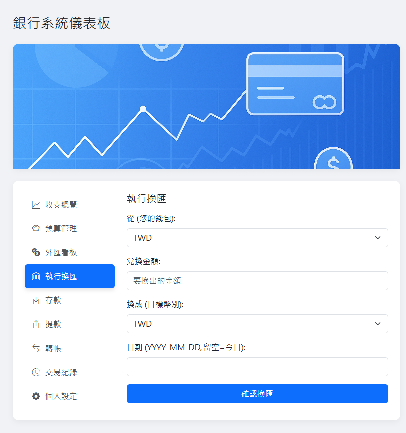
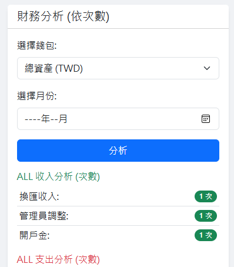
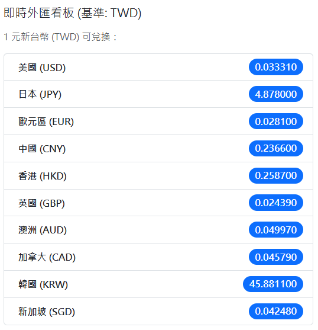
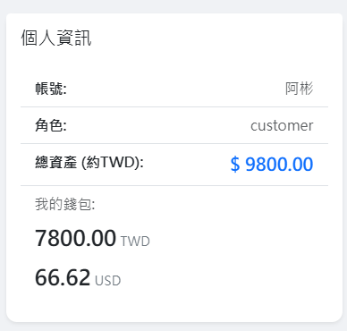
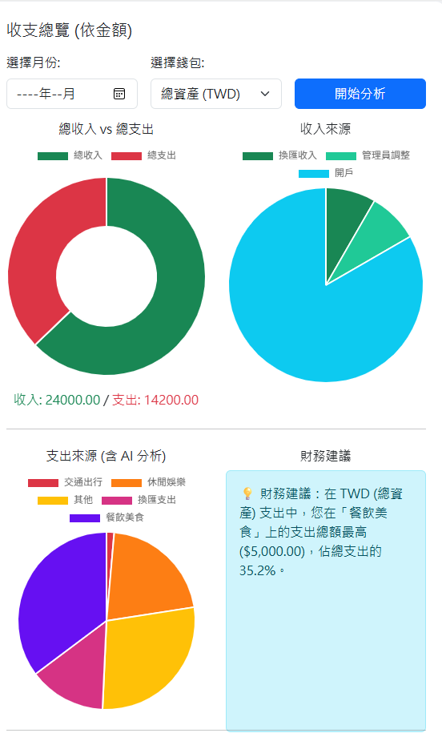
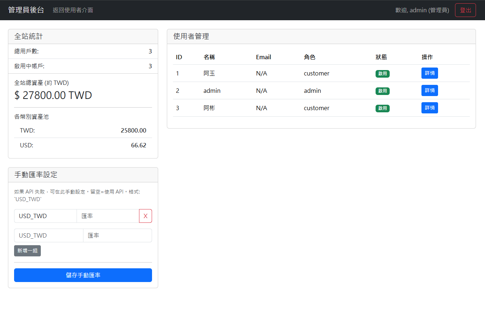

# 簡易銀行系統 (Simple Bank System)

這是一個使用 Python Flask 框架搭配 SQLite 資料庫打造的網頁版簡易銀行系統。專案前端採用 Bootstrap 5 美化介面，並透過 Chart.js 將收支狀況視覺化。後端除了實現銀行核心功能外，更整合了 AI 服務，能對消費紀錄進行智慧分類與總結。

## 系統功能展示 (Showcase)

| 功能介面 | 財務分析 |
| :---: | :---: |
|  |  |
| **即時匯率看板** | **個人資訊與錢包** |
|  |  |
| **收支總覽** | **管理者介面** |
|  |  |


## 功能特色 (Features)

| 類別 | 功能 | 詳細說明 |
| :--- | :--- | :--- |
| **核心使用者功能** | 註冊、登入、登出 | 標準的使用者身份驗證流程。 |
| | 多幣別錢包 | 使用者可擁有多個不同幣別（TWD, USD, JPY...）的錢包。 |
| | 存款 / 提款 | 針對特定幣別錢包進行存款與提款操作。 |
| | 轉帳 | 可在不同使用者之間進行**同幣別**的轉帳。 |
| | 換匯 | 根據即時匯率，在自己的不同幣別錢包間進行換匯。 |
| **數據分析** | AI 消費分析 | 智慧分析 TWD 支出，將提款、轉帳等歸為資產轉移，其餘消費備註則透過 AI 分類為餐飲、交通等，並以圓餅圖呈現**次數**分佈。 |
| | 收入分析 | 將存款、轉入、換匯等 TWD 收入依類型分類，並以甜甜圈圖呈現**次數**分佈。 |
| | 交易紀錄 | 提供完整交易歷史，並支援依月份篩選查詢。 |
| | CSV 匯出 | 可將篩選後的交易紀錄一鍵匯出為 `.csv` 檔案。 |
| **管理員功能** | 客戶總表 | 管理員登入後，可查看系統內所有客戶的列表與其角色。 |

## 技術棧 (Tech Stack)

- **後端 (Backend)**: Python, Flask
- **資料庫 (Database)**: SQLite
- **前端 (Frontend)**: JavaScript, Bootstrap 5, Chart.js, Flag Icon CSS
- **Python 套件 (Libraries)**: `Flask-Session`, `python-dotenv`, `requests`, `werkzeug`

## 專案結構 (Project Structure)

```
.
├── static/                    # 網頁的動態行為、圖片們
│   ├── css/                   # CSS 樣式表
│   └── img/                   # 圖片資源
│   └──admin.js                # 管理員後台的專用 JS
│   └──app.js                  # 使用者儀表板 JS
│   └──login.js                # 登入/註冊 JS
├── templates/                 # HTML 網頁模板
│   ├── login.html             # 靜態表單
│   └── register.html          # 同上
│   └── index.html             # 使用者的儀表板
│   └── admin.html             # 管理員主儀表板，用於顯示全站統計和使用者列表
│   └── admin_user_detail.html # 管理員編輯單一使用者的頁面，包含資料修改、手動調帳、以及可依月份篩選的交易紀錄表
├── .env                       # 環境變數檔案 (範本)
├── .gitignore                 # Git 忽略清單
├── app.py                     # Flask 主應用程式，定義所有路由 (Routes)
├── logic.py                   # 核心商業邏輯 (使用者、交易、分析等)
├── database.py                # 資料庫連線與初始化
├── schema.sql                 # 資料庫結構 (DDL)
├── ai_services.py             # AI 分類服務
├── exchange_rate.py           # 匯率 API 服務
├── requirements.txt           # Python 依賴套件
└── README.md                  # 本說明檔案
```

## 安裝與啟動 (Installation & Setup)

#### 1. **前置準備**
請確保您的電腦已安裝 `Python 3.8` 或更高版本。

#### 2. **下載專案**
```bash
# 使用 Git Clone
git clone https://github.com/DanielYu0713/Simple_Bank_System.git
cd Simple_Bank_System
```

#### 3. **設定虛擬環境**
為了保持專案環境的乾淨，強烈建議使用虛擬環境。
```bash
# 建立一個名為 venv 的虛擬環境
python -m venv venv

# 啟動虛擬環境
# Windows:
.\venv\Scripts\activate
# macOS / Linux:
source venv/bin/activate
```

#### 4. **安裝依賴套件**
專案所需的所有 Python 套件都記錄在 `requirements.txt` 中。
```bash
pip install -r requirements.txt
```

#### 5. **設定環境變數**
專案使用 `.env` 檔案來管理敏感資訊。請複製或重新命名 `.env.example` (如果有的話) 為 `.env`，並填入必要的 API 金鑰 (例如 AI 服務的金鑰)。
若您想持續用匯率相關的內容，請至 https://www.exchangerate-api.com/ 申請API。另外，此系統使用的HuggingFACE，您也可以換成其他OpenAI API，以下為基礎格式 :
```bash
HF_API_TOKEN="YOUR_OPEN_API_KEY"
EXCHANGE_RATE_API_KEY="YOUR_EXCHANGE_RATE_API_KEY"
```

#### 6. **初始化資料庫**
此指令會根據 `schema.sql` 建立 `bank.db` 資料庫檔案。
```bash
# 設定 Flask App 環境變數 (只需設定一次)
# Windows (CMD):
set FLASK_APP=app.py
# Windows (PowerShell):
$env:FLASK_APP = "app.py"
# macOS / Linux:
export FLASK_APP=app.py

# 執行資料庫初始化指令
flask init-db
```

#### 7. **建立管理員帳號**
您需要一個管理員帳號來查看所有使用者。
```bash
# 指令: flask create-admin <管理員名稱> <管理員密碼>
flask create-admin admin admin123
```

#### 8. **啟動應用程式**
```bash
flask run
```
啟動成功後，終端機將顯示服務運行的網址，通常是 `http://127.0.0.1:5000`。在瀏覽器中開啟此網址即可看到登入頁面。

## 未來可改進部分 (Future Improvements)

- **分析功能增強**: 
    - **金額分析**: 除了分析「次數」，也可以改為分析「金額」，讓使用者更能掌握資金流向的權重。
    - **跨幣別分析**: 將不同幣別的收支換算成基準貨幣（如 TWD），進行統一的財務分析。
- **使用者體驗 (UX)**: 
    - **非同步更新**: 使用 AJAX 或 WebSocket 技術，讓錢包餘額在交易後可以局部更新，無需重新整理整個頁面，體驗更流暢。
    - **互動式圖表**: 圖表可以做得更具互動性，例如點擊圖表區塊後，下方列表自動篩選出該分類的詳細交易。
- **測試 (Testing)**: 
    - **單元測試**: 針對 `logic.py` 中的每個函式編寫獨立的單元測試，確保商業邏輯的正確性。
    - **整合測試**: 建立自動化測試來驗證從 API 端點到資料庫的完整流程。
- **安全性強化 (Security)**: 
    - **密碼安全**: 引入更嚴格的密碼策略（如長度、特殊字元要求），並在多次登入失敗後鎖定帳號。
    - **防止惡意輸入**: 針對所有使用者輸入進行更嚴謹的驗證與清理，防止 SQL Injection 和 XSS 攻擊。
    - **CSRF 保護**: 啟用 Flask-WTF 或相關套件提供的 CSRF (跨站請求偽造) 保護機制。
- **非同步任務 (Async Tasks)**: 
    - 對於呼叫 AI 服務或寄送 Email 等可能耗時較長的任務，可以改用 Celery 或 RQ 等非同步任務佇列來處理，避免網頁請求被卡住，提升系統回應速度。
